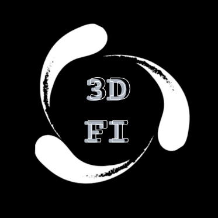

# 3DFI: Generate your 3D Model 


[3DFI](https://3DFI.AI) is a **Web-based tool** that poses MMD models from video input in real-time. Welcome feature requests and PRs!


## Features

- [x] Pose detection
- [x] Face detection
- [x] Hand detection (experimental)
- [x] Rust-WASM based pose-to-quaternion solver
- [x] 360-degree background selection
- [x] Video, image upload
- [x] Webcam input
- [x] Model selection
- [x] Ollama support 
- [x] VMD import/export (to export a valid VMD file, you must record at least one motion)
- [x] MMD editor: bone, material, mesh edit

## Hint

- Let your browser use dedicated GPU for better performance.

## Project Setup

```sh
npm install
```

### Compile and Hot-Reload for Development

```sh
npm run dev
```

### Type-Check, Compile and Minify for Production

```sh
npm run build
```

### Lint with [ESLint](https://eslint.org/)

```sh
npm run lint
```
